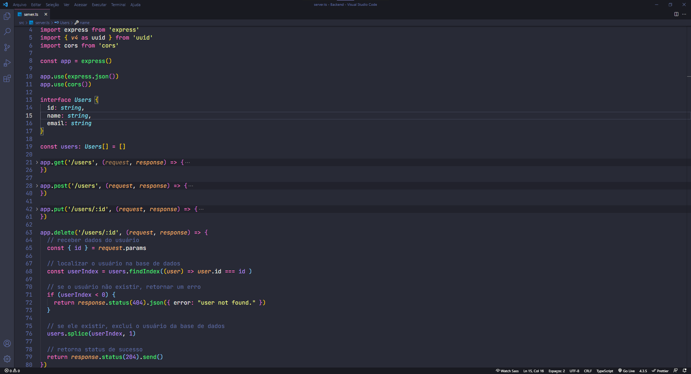

  

**Caminhos do projeto**
  - <a href="#sobre">Sobre</a>
  - <a href="#imagens">Imagens</a>
  - <a href="#ferramentas">Ferramentas</a>
  - <a href="#autor">Autor</a>

---

## Sobre
Este é um mini projeto realizado no curso de bootcamp da [Cataline](https://www.cataline.io/) focado em fullstack nas tecnologias **Vue.js** e **Adonis.js**.

Neste projeto foi criado uma aplicação estilo *CRUD*, que significa *C*reate, *R*ead, *U*pdate e *D*elete, onde podemos listar os usuários, criar novos usuários, atualizar eles e deletar eles.

## Imagens
*Aqui temos a tela inicial do projeto onde é mostrado o formulário de cadastro para novos usuários e também a listagem dos mesmos, e na imagem seguinte como ficou a aplicação por parte do backend:*

  
  

## Ferramentas
**Linguagens utilizadas:**
- [Typescript](https://www.typescriptlang.org/)
- [Vue.js](https://vuejs.org/)
- [Node.js](https://nodejs.org/en/)
  
**Ferramentas utilizadas:**
- [Insomnia](https://insomnia.rest/download)
- [Yarn](https://yarnpkg.com/)
- [Prettier](https://prettier.io/)

## Autor

## [Gabriel Bittencourt Penteado](https://www.linkedin.com/in/gabriel-bittencourt-penteado/)

#### Feito com 🤎 por *Gabriel Bittencourt Penteado*. Entre em contato! 👋🏽